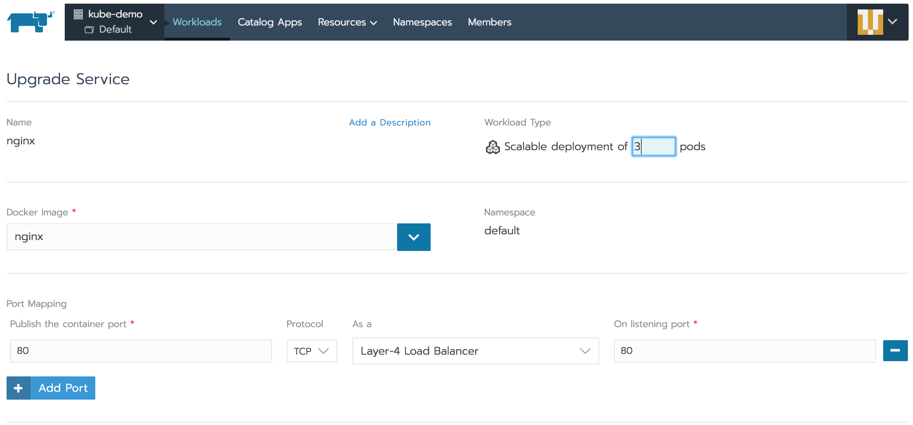

# **Intro to Kubernetes**

If you landed here, then you, somehow, must be related to Software Development, and you definitely heard about containers and how they make the lifecycle of an application much easier to manage. Now, containers indeed offer many benefits for an application - consistent runtime environment, small size on disk, low overhead, isolation - to name some of them.

That's all good, you have your application, you pack it into a container and you're ready to run it. Of course, you have your colleagues with their applications packed and ready to run, and there are a lot of applications in the same scenario. You need a way to manage all the containers that run and their lifecycle, how they interconnect, on what hardware are they running, how they get their storage, deal with errors when containers stop running for whatever reason. Here's where `Kubernetes` comes into play. Today we're going to look at **What is Kubernetes**, take the theory behind it and bind it directly with some hands-on tasks to help you understand every part of it.

### **A bit of Kubernetes history**

Kubernetes, also known as k8s (k ... 8 letters ... and s) or kube, is a word in greek that means *governor*, *helmsman* or *captain*. I think it has to do with the fact that real containers are carried in huge amounts by ships and the *captain* or *helmsman* is the one in charge, hence the analogy of Kubernetes as a container orchestrator in information technology space.

Kubernetes started as an open source project from Google in 2014, based on [15 years of Google's experience running containers](https://ai.google/research/pubs/pub43438). It has seen an enormous growth and widespread adoption, it has become the default go-to system for managing containers. Several years down the road and we have a production ready Kubernetes release that is already used by small and big companies alike, from development to production.

### **Kubernetes momentum**

With over 40.000 stars on github, over 50.000 commits in 2017, with more pull requests and issue comments than any other project on Github, kubernetes has grown very rapidly, some of the reasons behind it would be it's scalability and robust design patterns. Large software companies have published their use of kubernetes in these [case studies](https://kubernetes.io/case-studies/).

As the project was started by Google, normally Google was the main contributor to the project. That has changed and Google is now overtaken by private contributors:

This clearly shows the interest Kubernetes has created and it's momentum.

### **What Kubernetes has to offer**

Let's see what are the features that attract all the above interest in Kubernetes.

At the core, Kubernetes is a container-centric management environment. It orchestrates computing, networking, and storage infrastructure on behalf of user workloads. This provides much of the simplicity of Platform as a Service (PaaS) with the flexibility of Infrastructure as a Service (IaaS), and enables portability across infrastructure providers. Kubernetes is not a mere orchestration system. In fact, it eliminates the need for orchestration. The technical definition of orchestration is execution of a defined workflow: first do A, then B, then C. In contrast, Kubernetes is comprised of a set of independent, composable control processes that continuously drive the current state towards the provided desired state. It shouldn’t matter how you get from A to C. Centralized control is also not required. This results in a system that is easier to use and more powerful, robust, resilient, and extensible.

### **Kubernetes Concepts**

To work with Kubernetes, you use *Kubernetes API objects* to describe your cluster's *desired state*: what applications or other workloads you want to run, what container images they use, the number of replicas, what network and disk resources you want to make available, and more. You set your desired state by creating objects using the Kubernetes API, typically via the command-line interface, `kubectl`. You can also use the Kubernetes API directly to interact with the cluster and set or modify your desired state.

Once you’ve set your desired state, the Kubernetes Control Plane works to make the cluster’s current state match the desired state. To do so, Kubernetes performs a variety of tasks automatically – such as starting or restarting containers, scaling the number of replicas of a given application, and more.

The basic Kubernetes objects include:
- [**Node**](#node)
- [**Pod**](#pod)
- [**Service**](#service)
- [**Volume**](#volume)
- [**Namespace**](#namespaces)

In addition, Kubernetes contains a number of higher-level abstractions called Controllers. Controllers build upon the basic objects, and provide additional functionality and convenience features. They include:

- [**ReplicaSet**](#replicaset)
- [**Deployment**](#deployment)
- [**StatefulSet**](#statefulsets)
- [**DaemonSet**](#daemonset)
- [**Job**](#job)

Let's describe those one by one, after that we'll try them with some hands-on exercises.

#### **Node**

A `Node` is a worker machine in Kubernetes, previously known as a `minion`. A node may be a VM or physical machine, depending on the cluster. Each node contains the services necessary to run pods and is managed by the master components. You can think of a `Node` like this: a `Node` to the `Pod` is like a Hypervisor to VMs.

#### **Pod**

A `Pod` is the basic building block of Kubernetes – the smallest and simplest unit in the Kubernetes object model that you create or deploy. A `Pod` represents a unit of deployment: *a single instance of an application in Kubernetes*, which might consist of either a single container or a small number of containers that are tightly coupled and that share resources.

[Docker](https://www.docker.com/) is the most common container runtime used in a Kubernetes Pod, but Pods support other container runtimes as well.

Pods in a Kubernetes cluster can be used in two main ways:
- **Pods that run a single container**. The “one-container-per-Pod” model is the most common Kubernetes use case; in this case, you can think of a Pod as a wrapper around a single container, and Kubernetes manages `Pods` rather than the containers directly.
- **Pods that run multiple containers that need to work together**. A `Pod` might encapsulate an application composed of multiple co-located containers that are tightly coupled and need to share resources. These co-located containers might form a single cohesive unit of service – one container serving files from a shared volume to the public, while a separate “sidecar” container refreshes or updates those files. The `Pod` wraps these containers and storage resources together as a single manageable entity.

Pods provide two kinds of shared resources for their constituent containers: ***networking*** and ***storage***.

- **Networking**: Each `Pod` is assigned a unique IP address. Every container in a `Pod` shares the network namespace, including the IP address and network ports. Containers *inside a Pod* can communicate with one another using `localhost`. When containers in a `Pod` communicate with entities *outside the Pod*, they must coordinate how they use the shared network resources (such as ports).
- **Storage**: A Pod can specify a set of shared storage *volumes*. All containers in the Pod can access the shared volumes, allowing those containers to share data. Volumes also allow persistent data in a Pod to survive in case one of the containers within needs to be restarted.

#### **Service**

Kubernetes `Pods` are mortal, they are born and they die, they are not resurrected. Even if each `Pod` gets its own ip address, you cannot rely that it will be stable over time. This creates a problem, if a set of `Pods` (let's say backend) provides functionality to another set of `Pods` (lets say frontent) inside a Kubernetes cluster, how those frontends can keep a reliable communication to backend pods?

Here's where `Services` come into play.

A Kubernetes `Service` is an abstraction which defines a logical set of `Pods` and a policy by which to access them - sometimes called a micro-service. The set of `Pods` targeted by a `Service` is (usually) determined by a `Label Selector`.

For example if you have a backend application with 3 Pods, those pods are fungible, frontends do not care which backend they use. While the actual `Pods` that compose the backend set may change, the frontend clients should not need to be aware of that or keep track of the list of backends themselves. The `Service` abstraction enables this decoupling.

For applications in the same Kubernetes cluster, Kubernetes offers a simple `Endpoints` API that is updated whenever the set of `Pods` in a `Service` changes. For apps outside the cluster, Kubernetes offers a Virtual-IP-based bridge to `Services` which redirects to the backend `Pods`.

#### **Volume**

On-disk files in a Container are ephemeral, which presents some problems for non-trivial applications when running in Containers. First, when a Container crashes, it will be restarted by Kubernetes, but the files will be lost - the Container starts with a clean state. Second, when running multiple Containers together in a `Pod` it is often necessary to share files between those Containers. The Kubernetes `Volume` abstraction solves both of these problems.

At its core, a volume is just a directory, possibly with some data in it, which is accessible to the Containers in a `Pod`. How that directory comes to be, the medium that backs it, and the contents of it are determined by the particular volume type used.

A Kubernetes volume has explicit lifetime, the same as the `Pod` that creates it. As a conclusion, a volume outlives any Containers that run inside the `Pod`, and data is preserved across Container restarts. Normally, when a `Pod` ceases to exist, the volume will cease to exist, too. Kubernetes supports multiple types of volumes, and a `Pod` can use any number of them simultaneously.

#### **Namespaces**

Kubernetes supports multiple virtual clusters backed by the same physical cluster. These virtual clusters are called `namespaces`.

`Namespaces` provide a scope for names. Names of resources need to be unique within a `namespace`, but not across `namespaces`.

It is not necessary to use multiple `namespaces` just to separate slightly different resources, such as different versions of the same software: use `labels` to distinguish resources within the same `namespace`.

#### **ReplicaSet**

A *`ReplicaSet`* ensures that a specified number of pod replicas are running at any one time. In other words, a *`ReplicaSet`* makes sure that a pod or a homogeneous set of pods is always up and available. However, a `Deployment` is a higher-level concept that manages `ReplicaSets` and provides declarative updates to `Pods` along with a lot of other useful features. Therefore, it is recommended to use `Deployments` instead of directly using `ReplicaSets`, unless you require custom update orchestration or don’t require updates at all.

This actually means that you may never need to manipulate `ReplicaSet` objects, use a `Deployment` instead.

#### **Deployment**

A `Deployment` controller provides declarative updates for `Pods` and `ReplicaSets`.

You describe a *desired* state in a `Deployment` object, and the Deployment controller changes the actual state to the desired state at a controlled rate. You can define `Deployments` to create new `ReplicaSets`, or to remove existing `Deployments` and adopt all their resources with new `Deployments`.

#### **StatefulSets**

A `StatefulSet` is used to manage stateful applications, it manages the deployment and scaling of a set of `Pods` *and provides guarantees about the ordering and uniqueness* of these Pods.

A `StatefulSet` operates under the same pattern as any other Controller. You define your desired state in a `StatefulSet` object, and the `StatefulSet` controller makes any necessary updates to get there from the current state. Like a `Deployment` , a `StatefulSet` manages `Pods` that are based on an identical container spec. Unlike a `Deployment`, a `StatefulSet` maintains a sticky identity for each of their `Pods`. These `Pods` are created from the same spec, but are not interchangeable: each has a persistent identifier that it maintains across any rescheduling.

#### **DaemonSet**

A `DaemonSet` ensures that all (or some) Nodes run a copy of a `Pod`. As nodes are added to the cluster, Pods are added to them. As nodes are removed from the cluster, those `Pods` are garbage collected. Deleting a `DaemonSet` will clean up the `Pods` it created.

Some typical uses of a `DaemonSet` are:

- running a cluster storage daemon, such as `glusterd`, `ceph`, on each node.
- running a logs collection daemon on every node, such as `fluentd` or `logstash`.
- running a node monitoring daemon on every node, such as `Prometheus Node Exporter` or `collectd`.

#### **Job**

A `job` creates one or more pods and ensures that a specified number of them successfully terminate. As `Pods` successfully complete, the `job` tracks the successful completions. When a specified number of successful completions is reached, the `job` itself is complete. Deleting a `Job` will cleanup the `Pods` it created.

A simple case is to create one `Job` object in order to reliably run one `Pod` to completion. The `Job` object will start a new `Pod` if the first `Pod` fails or is deleted (for example due to a node hardware failure or a node reboot).

### **Operational Challenges**

Now that you've seen the objects used in Kubernetes, it is noticeable that there's quite some amount of information to understand to properly use Kubernetes. Let's see some of the challenges that come in mind when trying to use Kubernetes:
- how can you deploy consistently across different infrastructures?
- how to implement and manage access control across multiple clusters (and namespaces)?
- how to integrate with a central authentication system?
- how to partition clusters to more efficiently use resources?
- how to manage multi-tenancy, multiple dedicated and shared clusters?
- how to create highly available clusters?
- how to ensure that security policies are enforced across clusters/namespaces?
- how to monitor so there's sufficient visibility to detect and troubleshoot issues?
- how to keep up with Kubernetes development, that is moving at a very fast pace?

Here's where [Rancher](https://rancher.com/) can help you. Rancher is an open source container manager used to run Kubernetes in production. Below are some features that Rancher provides:
- easy-to-use interface for kubernetes configuration and deployment;
- infrastructure management across multiple clusters and clouds;
- automated deployment of the latest kubernetes release;
- workload, RBAC, policy and project management;
- 24x7 enterprise-grade support.

Rancher becomes your single point of control for multiple clusters running on pretty much any infrastructure that can run Kubernetes:

#### **Hands-on with Rancher and Kubernetes**

Now let's see how can you use the above described Kubernetes objects with Rancher's help. At first you will need a rancher instance, please follow [this guide](https://rancher.com/docs/rancher/v2.x/en/quick-start-guide/deployment/quickstart-manual-setup/) to start one and create a Kubernetes cluster with it.

After starting your cluster you should see your cluster's resources in Rancher:

To start with the first Kubernetes Object - the **Node**, on the top menu, click on `Nodes`. You should see a nice overview of the `Nodes` that form your Kubernetes cluster:

There you can also see the number of pods already deployed to each node from your Kubernetes Cluster. Those pods are used by Kubernetes and Rancher internal systems. Normally you shouldn't have to deal with those.

Let's proceed with an example of **Pod**. To do that, go to the `Default` project of your Kubernetes cluster and you should land on the Workloads tab. Let's deploy a workload. Click on `Deploy` and set the `Name` and the `Docker image` to be `nginx`, leave everything else with their default values and clik `Launch`.

Once created, the `Workloads` tab should show the `nginx` Workload.

If you click on `nginx` workload, you will see that under the hood, `Rancher` actually created a **Deployment**, just as recommended by Kubernetes to manage **ReplicaSets** and you will also see the **Pod** created by that **ReplicaSet**:

Now you have a `Deployment`, that makes sure that our desired state is correctly represented in the cluster. Let's play a little bit with it and scale this Workload to 3, by clicking the `+` near `Scale`. Once you do that, you should instantly see 2 more `Pods` created and 2 more `ReplicaSet` scaling events. Try to delete one of the pods, by using the right-hand side menu of the `Pod` and notice how `ReplicaSet` is recreating it back, to match the desired state.

So you have your application up and running and it is scaled to 3 instances already, the question that comes to mind now is - how can you access it? Here we will try the **Services** Kubernetes object. To expose our `nginx` workload, we need to edit it, select `Edit` from the right-hand side menu of the `Workload`. You will be presented with the Deploy Workload page, filled already with your `nginx` workload's details:

Notice that you have 3 pods, next to `Scalable Deployment`, but when you started, the default was 1. This is a result of the scaling you've done just a bit earlier.

Now click on `Add Port` and fill the values as follows:
- set the `Publish the container port` value to `80`;
- leave the `Protocol` to be `TCP`;
- set the `As a` value to `Layer-4 Load Balancer`;
- set the `On listening port` value to `80`.

And confidently click on `Upgrade`. This will create an External Load Balancer in your cloud provider and will direct traffic to the `nginx` `Pods` in your Kubernetes Cluster. To test this, go again in the `nginx` workload overview page, and now you should see `80/tcp` link right next to `Endpoints`:

If you click on `80/tcp` it will take you to the external ip of the load balancer that you just created and should present you with a default nginx page, confirming that everything works as expected.

With this, you've covered most of the Kubernetes objects presented above. You can play around Rancher with `Volumes` and `Namespaces` and surely you'll figure out how to use them properly via Rancher. As for `StatefulSet`, `DaemonSet` and `Job`, those are very similar to `Deployments` and in Rancher, you'd create one of those also from `Workloads` tab, by selecting the `Workload type`.

## **Some final thoughts**

Let's recap what you've done in the above hands-on exercises. You've created most of the Kubernetes objects we described:
- you started with a kubernetes cluster in Rancher;
- you then browsed cluster [`Nodes`](#node);
- then you created a `Workload`;
- then you've seen that a `Workload` actually created 3 separate Kubernetes objects: a [`Deployment`](#deployment) that manages a [`ReplicaSet`](#replicaset), that in turn, keeps the desired number of [`Pods`](#pod) running;
- after that you scaled your [`Deployment`](#deployment) and observed how that in turn changed the `ReplicaSet` and consequently scaled the number of [`Pods`](#pod);
- and lastly you created a [`Service`](#service) of type `Load Balancer`, that is balancing client's requests between the [`Pods`](#pod).

And all that was easily done via [**Rancher**](https://rancher.com/), with point-and-click actions, without the need to install any software locally, to copy authentication configurations or to run command lines in a terminal, all that was needed - a browser. And that's just the surface of Rancher. Pretty convenient I'd say.

If you reached this point, I want to thank you for your time and hopefully your journey to Kubernetes world will be easier now with Rancher.
